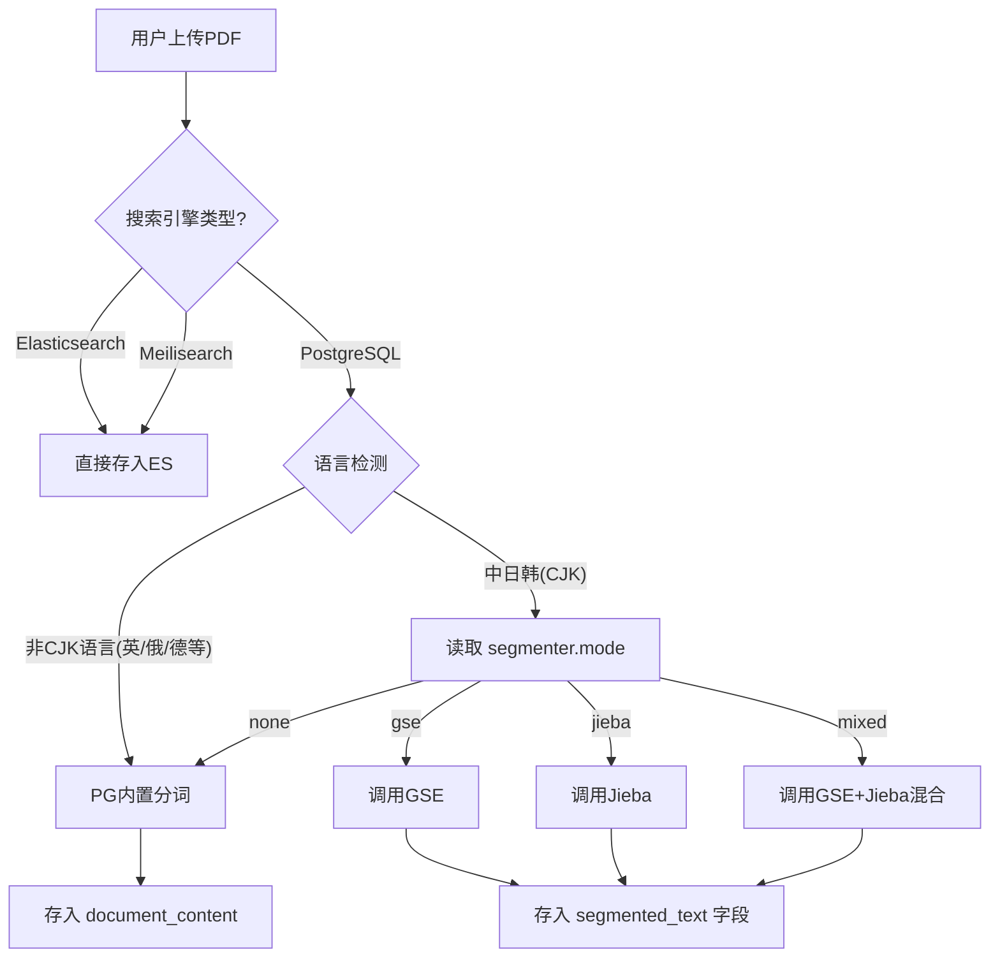

# 分词搜索方案 - 搜索引擎优先 + 可选混合模式

## 🎯 核心原则

**应用层分词** 仅作为 **PostgreSQL搜索** 的补充方案。在使用 **Elasticsearch** 或 **Meilisearch** 时，完全依赖搜索引擎内置分词，应用层**不进行分词**。当仅使用 PG 且需要高质量中文搜索时，提供 **Mixed (混合模式)** 作为高级选项。

---

## 🏗️ 搜索架构选择

### 场景1：Elasticsearch (推荐，生产环境)
- **分词方式**：使用 ES 插件 `analysis-ik`
- **应用层动作**：直接发送提取的 PDF 文本原文
- **准确率**：⭐⭐⭐⭐⭐ (IK-Max-Word)
- **内存占用**：应用层 0MB (ES 占用 512MB+)
- **配置**：`search_engine.type: "elasticsearch"`, `segmenter.mode: "none"`

### 场景2：Meilisearch (轻量级)
- **分词方式**：内置多语言分词（One-Stop Shop）
- **应用层动作**：直接发送文本原文
- **准确率**：⭐⭐⭐⭐
- **内存占用**：应用层 0MB (Meili 占用 ~100MB)
- **配置**：`search_engine.type: "meilisearch"`, `segmenter.mode: "none"`

### 场景3：PostgreSQL Only (无第三方搜索)
- **分词方式**：**应用层分词** + PG `tsvector`
- **应用层动作**：
  1. 判断文本语言（CJK 或 英文）
  2. 若是 CJK -> 根据配置调用 Jieba/GSE/Mixed 分词 -> 存入 `segmented_text` 字段
  3. 若是 英文 -> 直接存入 PG (适用标准分词)
- **配置**：`search_engine.type: "postgres"`, `segmenter.mode: "mixed"` (或 gse/jieba)

---

## 🧩 分词模式对比 (PostgreSQL 场景)

如果无法部署第三方搜索引擎，您可以根据资源和精度需求选择以下应用层分词模式：

| 模式 | 适用场景 | 内存占用 (Go) | 启动速度 | 准确率 | 备注 |
|------|----------|---------------|----------|--------|------|
| **None** | 英文文档为主 | 0 MB | 即时 | N/A | 仅依靠近似搜索 (LIKE) 或 PG默认解析 |
| **GSE** | **内存受限 (512MB强约束)** | 20-40 MB | 快 (50ms) | ⭐⭐⭐ | 性能优先，适合低配VPS |
| **Jieba** | **精度优先** | 60-100 MB | 慢 (200ms) | ⭐⭐⭐⭐⭐ | 准确率高，支持新词发现 |
| **Mixed** | **平衡方案 (推荐)** | 70-110 MB | 中 (250ms) | ⭐⭐⭐⭐⭐ | **GSE初分 + Jieba精修**，兼顾速度与精度 |

> **Mixed 模式原理**：先用 GSE 快速过一遍，对于置信度低的片段或歧义词，再调用 Jieba 进行二次确认。这比纯 Jieba 略快，比纯 GSE 更准，但内存消耗最大。

---

## ⚙️ 动态分词策略 (Smart Segmenter)

后台设置一个**特性开关 (Feature Flag)**，控制是否启用应用层分词。

### 逻辑流程图



### ⚠️ 多语言支持注意事项 (Multilingual Support)

**Mixed/GSE/Jieba 模式仅针对 CJK (中日韩) 语言优化。**

- **西里尔/拉丁语系 (俄语、德语、法语等)**：
  - **表现**：❌ 兼容性差。虽然能按空格切分，但**无法进行词干提取 (Stemming)** (例如无法匹配 `running` 和 `run`)。
  - **建议**：直接使用 PostgreSQL 内置分词器，指定对应语言配置 (如 `to_tsvector('russian', ...)` 或 `simple`)。

- **非空格语言 (泰语、高棉语等)**：
  - **表现**：❌ 完全不可用。会被视为乱码或作为一个长词处理。
  - **建议**：必须使用 **Elasticsearch** (配合 ICU 分词器) 或 **Meilisearch**。PostgreSQL 对此类语言支持有限。

---

## 🛠️ 实现细节

### 1. 配置结构 (app.yaml)

```yaml
# 搜索引擎配置
search_engine:
  type: "postgres" # 或 "elasticsearch", "meilisearch"

# 分词器配置 (仅当 type="postgres" 时生效)
segmenter:
  enable_cjk: true      # 开关：是否对CJK启用应用层分词
  mode: "mixed"         # 可选: "gse" | "jieba" | "mixed" | "none"
  mixed_strategy: "concurrent" # 仅 Mixed 模式有效: "concurrent" (并发, 快) | "deferred" (延迟, 省内存)
  dict_path: "config/dictionary.txt"
```

### 2. 代码逻辑 (SegmentFactory)

```go
// SegmentText 根据配置选择分词策略
func (s *SegmentService) SegmentText(text string) []string {
    switch s.config.Mode {
    case "mixed":
    if s.config.MixedStrategy == "deferred" {
       // 策略A：仅GSE快速处理，并在后台队列中标记需要 Jieba 二次精修
       s.queueForRefinement(text)
       return s.gseSegment(text)
    }
    return s.mixedSegmentConcurrent(text) // GSE + Jieba同时运行
    case "jieba":
        return s.jiebaSegment(text)
    case "gse":
        return s.gseSegment(text)
    default:
        return []string{text}
    }
}
```

### 3. 自定义词典与热更新 (Dynamic Dictionary)

为了解决特定领域名词 (如 "深度学习", "Transformer模型") 无法识别的问题，系统支持**数据库级自定义词典**，此功能无需重启即生效。

#### (1) 数据库设计

```sql
CREATE TABLE custom_dictionary (
   id SERIAL PRIMARY KEY,
   term VARCHAR(100) NOT NULL UNIQUE, -- 词汇 (e.g., "Transformer")
   frequency INT DEFAULT 0,           -- 词频 (用于Jieba, GSE默认忽略或使用高频)
   nature VARCHAR(20) DEFAULT 'nz',   -- 词性 (可选)
   is_enable BOOLEAN DEFAULT TRUE,    -- 是否启用
   updated_at TIMESTAMP DEFAULT CURRENT_TIMESTAMP
);
```

#### (2) 热更新流程 (Hot Reload)

1.  **后台管理**：管理员在后台添加/编辑词汇 -> 写入 PG 数据库。
2.  **通知机制**：应用检测到变更 (或通过 Redis Pub/Sub 通知)。
3.  **内存加载**：
  -   **GSE**：调用 `segmenter.AddToken("自定义词", freq)`。
  -   **Jieba**：调用 `jieba.AddWord("自定义词")`。
4.  **生效**：后续的分词操作立即生效，**无需重启服务**。
5.  **启动加载**：服务重启时，自动加载 `dict_path` 文件 + `custom_dictionary` 表中的所有词汇。

### 4. Mixed 模式的内存优化策略 (Memory Optimization)

针对 Mixed 模式内存占用叠加的问题，提供两种执行策略供后台配置：

| 策略 | 机制 | 优点 | 缺点 | 内存特征 |
| :--- | :--- | :--- | :--- | :--- |
| **Concurrent (并发)** | 上传 PDF 时，同时加载 GSE 和 Jieba 进行混合运算。 | **即时性**：文档上传完立刻拥有最高精度索引。 | **峰值高**：同时持有两份字典内存。 | 峰值 ~110MB |
| **Deferred (延迟)** | **1. 上传时**：仅用 GSE 快速分词 (低内存)。<br>**2. 后台任务**：闲时启动 Jieba Worker 对文档进行"精修"更新。 | **削峰填谷**：上传快，瞬时内存低。用户先搜到大概，稍后变精准。 | **最终一致性**：高精度索引有几分钟延迟。 | 峰值 ~40MB (上传时) <br> ~70MB (后台任务时) |

> **推荐配置**：512MB 内存机器建议使用 `deferred` 策略，避免上传大文件时 OOM。

  ### 5. 数据存储与混合索引策略 (Hybrid Indexing)

  为了**不影响 PostgreSQL 原生全文搜索**能力，采取 **"双字段 + 组合查询"** 策略：

  | 字段名 | 存储内容 | 索引类型 | 用途 |
  | :--- | :--- | :--- | :--- |
  | **`content`** | 原始 PDF 文本 | `GIN (to_tsvector('english', content))` | **原生搜索**：负责英文、数字、俄语等标准切分语言。保留 PG 自带的 stemming 能力。 |
  | **`segmented_content`** | 应用层分词后的空格分隔字符串 (如 "人工 智能 发展") | `GIN (to_tsvector('simple', segmented_content))` | **CJK 搜索**：负责中日韩内容的精确匹配。使用 `simple` 配置避免 PG再进行干扰。 |

  **SQL 查询逻辑**：
  同时检索两个字段，结果取并集。这样既能搜到 "running" (通过 `content` 匹配 `run`)，也能搜到 "人工智能" (通过 `segmented_content` 匹配)。

  ```sql
  SELECT * FROM documents 
  WHERE 
    -- 1. 原生 PG 搜索 (兼容多语言 + 英文词干)
    to_tsvector('english', content) @@ to_tsquery('english', 'running')
    OR
    -- 2. 应用层分词搜索 (针对 CJK)
    to_tsvector('simple', segmented_content) @@ to_tsquery('simple', '人工智能')
  ```

### 6. 深度对比：Jieba vs GSE

| 维度 | Jieba (Go版) | GSE (Go Efficient Segmenter) |
| :--- | :--- | :--- |
| **算法原理** | **HMM (隐马尔可夫模型)** + 字典树 (Trie) | **双数组字典树 (Double Array Trie)** + 最短路径 |
| **新词发现** | ✅ **支持** (基于统计模型发现未登录词) | ❌ 弱 (主要依赖词典，新词识别能力差) |
| **内存占用** | 高 (~60MB - 100MB) | **极低** (~20MB - 40MB) |
| **分词速度** | 较慢 (约 4MB/s) | **极快** (约 20MB/s) |
| **准确率** | ⭐⭐⭐⭐⭐ (适合文学、长文本) | ⭐⭐⭐ (适合搜索索引、短语) |
| **典型缺��** | 启动慢，内存占用大，无法在极小容器运行 | 对歧义词处理较差 (如 "南京市长江大橋") |

**选型结论**：
- **选 Jieba**：如果你需要**最高精度的中文搜索**，且服务器有 1GB 以上内存。
- **选 GSE**：如果你的 Go 应用必须跑在 **512MB 内存限制**下，或者你需要极致的索引速度。

---

## ⚖️ 方案建议

1.  **首选**：部署 **Meilisearch** 或 **Elasticsearch**。这是最省心、性能最好的方案。
2.  **次选 (高配VPS)**：如果无法部署搜索服务，但内存充裕 (>1GB)，使用 **PG + Mixed** 模式。
3.  **保底 (低配VPS)**：如果内存严格受限 (512MB Total)，使用 **PG + GSE** 模式。
