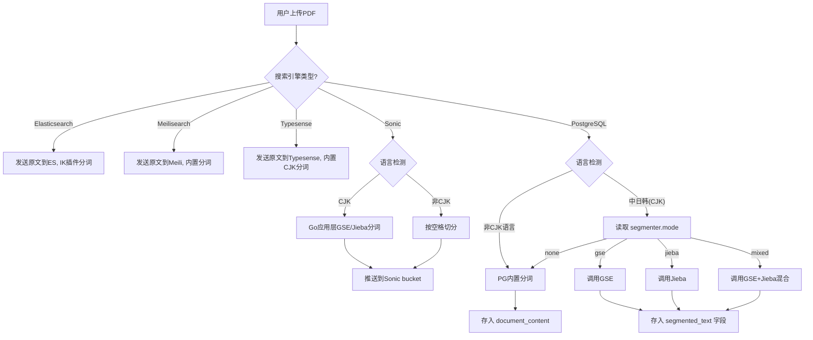

# 分词搜索方案 - 搜索引擎优先 + 可选混合模式

## 🎯 核心原则

**应用层分词** 仅作为 **PostgreSQL搜索** 的补充方案。在使用 **Elasticsearch** 或 **Meilisearch** 时，完全依赖搜索引擎内置分词，应用层**不进行分词**。当仅使用 PG 且需要高质量中文搜索时，提供 **Mixed (混合模式)** 作为高级选项。

---

## 🏗️ 搜索架构选择

### 场景总览

| 场景 | 引擎 | CJK 分词 | 内存占用 | 复杂度 | 推荐场景 |
|------|------|----------|----------|--------|----------|
| 1 | Elasticsearch | IK 插件 | ⚠️ 512MB+ | 高 | 大型生产 |
| 2 | Meilisearch | 内置 | ~100MB | 低 | 中小型快速搭建 |
| 3 | Typesense | 内置 | ~80-150MB | 低 | 中小型，比 Meili 更快 |
| 4 | Sonic + PG | Go 应用层预分词 | 🟢 10-30MB | 中 | **极致省内存** |
| 5 | PostgreSQL Only | Go 应用层分词 | 0MB（无额外服务） | 中 | 最简部署 |

---

## 🌐 引擎部署模式：全部独立服务，HTTP/TCP 连接

**所有搜索引擎都是独立进程**，与 Go 后端通过 HTTP 或 TCP 通信。可以部署在同一台 VPS，也可以部署在完全不同的机器上。

```
┌──────────────────────┐          HTTP/TCP         ┌──────────────────────┐
│     VPS A（应用）      │ ──────────────────────→   │   VPS B（搜索引擎）    │
│                       │                           │                      │
│  Go 后端 :8080        │   search_engine:          │  Typesense :8108     │
│  PG :5432             │     url: "http://         │  Meilisearch :7700   │
│  MinIO :9000          │      vps-b:8108"          │  Sonic :1491         │
│                       │                           │  ES :9200            │
├───────────────────────┤                           ├──────────────────────┤
│ 内存紧张 (512MB)       │                           │ 内存充裕 (1-4GB+)     │
│ 只跑应用和数据库        │                           │ 搜索引擎独占资源       │
└──────────────────────┘                           └──────────────────────┘
```

| 引擎 | 协议 | 默认端口 | 远程部署 | 连接方式 |
|------|------|----------|----------|----------|
| Elasticsearch | HTTP REST | 9200 | ✅ | `http://<host>:9200` |
| Meilisearch | HTTP REST | 7700 | ✅ | `http://<host>:7700` |
| Typesense | HTTP REST | 8108 | ✅ | `http://<host>:8108` |
| Sonic | TCP 自定义 | 1491/1492 | ✅ | `sonic.NewSearch("host:1491")` |

### config/app.yaml 远程配置示例

```yaml
# 方式1：同一台机器
search_engine:
  type: "typesense"
  typesense:
    url: "http://localhost:8108"
    api_key: "typesense_secret"

# 方式2：同一内网另一台 VPS
search_engine:
  type: "typesense"
  typesense:
    url: "http://10.0.0.5:8108"
    api_key: "typesense_secret"

# 方式3：通过 Tailscale/WireGuard 内网穿透
search_engine:
  type: "sonic"
  sonic:
    host: "100.64.0.2"       # Tailscale 私有 IP
    search_port: 1491
    ingest_port: 1492
    password: "SecretPassword"
```

> **安全提示**：不要将搜索引擎端口直接暴露在公网（`0.0.0.0:8108`），这些引擎的认证通常只有一个 API Key。用防火墙/VPN/内网隔离。

---

### 场景1：Elasticsearch (重量级，超大文档库)
- **分词方式**：使用 ES 插件 `analysis-ik`
- **应用层动作**：直接发送提取的 PDF 文本原文
- **准确率**：⭐⭐⭐⭐⭐ (IK-Max-Word)
- **内存占用**：应用层 0MB（ES 占用 512MB+）
- **配置**：`search_engine.type: "elasticsearch"`, `segmenter.mode: "none"`
- **适用**：文档量 >10 万，需要复杂聚合/分析

### 场景2：Meilisearch (轻量级，开箱即用)
- **分词方式**：内置多语言分词
- **应用层动作**：直接发送文本原文
- **准确率**：⭐⭐⭐⭐
- **内存占用**：应用层 0MB（Meili 占用 ~100MB）
- **配置**：`search_engine.type: "meilisearch"`, `segmenter.mode: "none"`
- **适用**：文档量 <5 万，追求零配置

### 场景3：Typesense (轻量高速) 🆕
- **分词方式**：内置 CJK 分词（`token_separators` + `symbols_to_index` 配置）
- **应用层动作**：直接发送文本原文
- **准确率**：⭐⭐⭐⭐
- **内存占用**：应用层 0MB（Typesense 占用 ~80-150MB）
- **配置**：`search_engine.type: "typesense"`, `segmenter.mode: "none"`
- **适用**：文档量 <10 万，追求搜索速度 + 低运维
- **优势**：
  - C++ 编写，比 Meilisearch（Rust）在纯计算场景更快 2-5x
  - 内置高亮 snippet、拼写纠错、facet 过滤
  - 单二进制部署，Docker 镜像 <50MB
  - RESTful API，Go SDK 成熟
- **CJK 配置示例**：
  ```json
  {
    "name": "documents",
    "fields": [
      {"name": "title", "type": "string", "locale": "zh"},
      {"name": "content", "type": "string", "locale": "zh"},
      {"name": "page_num", "type": "int32"}
    ]
  }
  ```

### 场景4：Sonic + PostgreSQL (极致省内存) 🆕
- **分词方式**：**Go 应用层预分词**（GSE/Jieba）→ Sonic 只负责倒排索引
- **应用层动作**：
  1. 提取 PDF 文本 → GSE/Jieba 分词 → 将分词结果推送到 Sonic bucket
  2. 搜索时：Go 分词用户查询 → 发送给 Sonic → Sonic 返回匹配的 `(bucket, object_id)` 列表
  3. Go 拿到 ID 列表后 → 回到 PG 做 `WHERE id IN (...)` 主键查询 → 拿到完整文档/高亮数据
- **内存占用**：
  - Sonic: **10-30MB**（百万级文档）
  - Go 应用层分词: 20-40MB (GSE)
  - 合计: **30-70MB**，远低于任何独立搜索引擎
- **配置**：`search_engine.type: "sonic"`, `segmenter.mode: "gse"`
- **适用**：内存极度受限（如 1GB VPS 跑全部服务），文档量 <100 万
- **优势**：
  - Rust 编写，内存占用极低，无 GC
  - 只存倒排索引，不存原文（原文在 PG 里）
  - 单二进制，部署极简
- **劣势**：
  - ⚠️ Sonic **不懂 CJK**，必须应用层先分好词，以空格分隔的 word 为单位推送
  - ⚠️ Sonic 不返回高亮 snippet，需自己从 PG 读取原文后用 Go 实现高亮
  - ⚠️ 只支持 term 搜索，不支持模糊/拼音/同义词
  - ⚠️ 需维护 Go 分词 ↔ Sonic 之间的数据一致性

### 场景5：PostgreSQL Only (最简部署)
- **分词方式**：**应用层分词** + PG `tsvector`
- **应用层动作**：
  1. 判断文本语言（CJK 或 英文）
  2. **异步处理**：后台 Worker 对文本进行分词，避免阻塞上传接口
  3. 若是 CJK -> 调用 Jieba/GSE/Mixed 分词 -> 存入 `segmented_text` 字段（空格分隔）
  4. 若是 英文 -> 直接存入 PG (适用标准分词)
- **配置**：`search_engine.type: "postgres"`, `segmenter.mode: "mixed"`
- **适用**：不想引入任何额外服务的场景

---

## 🧩 分词模式对比 (PostgreSQL 场景)

如果无法部署第三方搜索引擎，您可以根据资源和精度需求选择以下应用层分词模式：

| 模式 | 适用场景 | 内存占用 (Go) | 启动速度 | 准确率 | 备注 |
|------|----------|---------------|----------|--------|------|
| **None** | 英文文档为主 | 0 MB | 即时 | N/A | 仅依靠近似搜索 (LIKE) 或 PG默认解析 |
| **GSE** | **内存受限 (512MB强约束)** | 20-40 MB | 快 (50ms) | ⭐⭐⭐ | 性能优先，适合低配VPS |
| **Jieba** | **精度优先** | 60-100 MB | 慢 (200ms) | ⭐⭐⭐⭐⭐ | 准确率高，支持新词发现 |
| **Mixed** | **平衡方案 (推荐)** | 70-110 MB | 中 (250ms) | ⭐⭐⭐⭐⭐ | **GSE初分 + Jieba精修**，兼顾速度与精度 |

> **Mixed 模式原理**：先用 GSE 快速过一遍，对于置信度低的片段或歧义词，再调用 Jieba 进行二次确认。这比纯 Jieba 略快，比纯 GSE 更准，但内存消耗最大。

---

## ⚙️ 动态分词策略 (Smart Segmenter)

后台设置一个**特性开关 (Feature Flag)**，控制是否启用应用层分词。

### 逻辑流程图



### ⚠️ 多语言支持注意事项 (Multilingual Support)

**Mixed/GSE/Jieba 模式仅针对 CJK (中日韩) 语言优化。**

- **西里尔/拉丁语系 (俄语、德语、法语等)**：
  - **表现**：❌ 兼容性差。虽然能按空格切分，但**无法进行词干提取 (Stemming)** (例如无法匹配 `running` 和 `run`)。
  - **建议**：直接使用 PostgreSQL 内置分词器，指定对应语言配置 (如 `to_tsvector('russian', ...)` 或 `simple`)。

- **非空格语言 (泰语、高棉语等)**：
  - **表现**：❌ 完全不可用。会被视为乱码或作为一个长词处理。
  - **建议**：必须使用 **Elasticsearch** (配合 ICU 分词器) 或 **Meilisearch**。PostgreSQL 对此类语言支持有限。

---

## 🛠️ 实现细节

### 1. 配置结构 (app.yaml)

```yaml
# 搜索引擎配置
search_engine:
  type: "postgres" # 或 "elasticsearch", "meilisearch"

# 分词器配置 (仅当 type="postgres" 时生效)
segmenter:
  enable_cjk: true      # 开关：是否对CJK启用应用层分词
  mode: "mixed"         # 可选: "gse" | "jieba" | "mixed" | "none"
  mixed_strategy: "concurrent" # 仅 Mixed 模式有效: "concurrent" (并发, 快) | "deferred" (延迟, 省内存)
  dict_path: "config/dictionary.txt"
```

### 2. 代码逻辑 (SegmentFactory)

```go
// SegmentText 根据配置选择分词策略
func (s *SegmentService) SegmentText(text string) []string {
    switch s.config.Mode {
    case "mixed":
    if s.config.MixedStrategy == "deferred" {
       // 策略A：仅GSE快速处理，并在后台队列中标记需要 Jieba 二次精修
       s.queueForRefinement(text)
       return s.gseSegment(text)
    }
    return s.mixedSegmentConcurrent(text) // GSE + Jieba同时运行
    case "jieba":
        return s.jiebaSegment(text)
    case "gse":
        return s.gseSegment(text)
    default:
        return []string{text}
    }
}
```

### 3. 自定义词典与热更新 (Dynamic Dictionary)

为了解决特定领域名词 (如 "深度学习", "Transformer模型") 无法识别的问题，系统支持**数据库级自定义词典**，此功能无需重启即生效。

#### (1) 数据库设计

```sql
CREATE TABLE custom_dictionary (
   id SERIAL PRIMARY KEY,
   term VARCHAR(100) NOT NULL UNIQUE, -- 词汇 (e.g., "Transformer")
   frequency INT DEFAULT 0,           -- 词频 (用于Jieba, GSE默认忽略或使用高频)
   nature VARCHAR(20) DEFAULT 'nz',   -- 词性 (可选)
   is_enable BOOLEAN DEFAULT TRUE,    -- 是否启用
   updated_at TIMESTAMP DEFAULT CURRENT_TIMESTAMP
);
```

#### (2) 热更新流程 (Hot Reload)

1.  **后台管理**：管理员在后台添加/编辑词汇 -> 写入 PG 数据库。
2.  **通知机制**：应用检测到变更 (或通过 Redis Pub/Sub 通知)。
3.  **内存加载**：
  -   **GSE**：调用 `segmenter.AddToken("自定义词", freq)`。
  -   **Jieba**：调用 `jieba.AddWord("自定义词")`。
4.  **生效**：后续的分词操作立即生效，**无需重启服务**。
5.  **启动加载**：服务重启时，自动加载 `dict_path` 文件 + `custom_dictionary` 表中的所有词汇。

### 4. Mixed 模式的内存优化策略 (Memory Optimization)

针对 Mixed 模式内存占用叠加的问题，提供两种执行策略供后台配置：

| 策略 | 机制 | 优点 | 缺点 | 内存特征 |
| :--- | :--- | :--- | :--- | :--- |
| **Concurrent (并发)** | 上传 PDF 时，同时加载 GSE 和 Jieba 进行混合运算。 | **即时性**：文档上传完立刻拥有最高精度索引。 | **峰值高**：同时持有两份字典内存。 | 峰值 ~110MB |
| **Deferred (延迟)** | **1. 上传时**：仅用 GSE 快速分词 (低内存)。<br>**2. 后台任务**：闲时启动 Jieba Worker 对文档进行"精修"更新。 | **削峰填谷**：上传快，瞬时内存低。用户先搜到大概，稍后变精准。 | **最终一致性**：高精度索引有几分钟延迟。 | 峰值 ~40MB (上传时) <br> ~70MB (后台任务时) |

> **推荐配置**：512MB 内存机器建议使用 `deferred` 策略，避免上传大文件时 OOM。

  ### 5. 数据存储与混合索引策略 (Hybrid Indexing)

  采用 **"应用层分词 + PG Simple配置"** 策略，完全避免安装额外的 PG 插件，降低运维成本。

  | 字段名 | 存储内容 | 索引类型 | 用途 |
  | :--- | :--- | :--- | :--- |
  | **`content`** | 原始 PDF 文本 | `GIN (to_tsvector('english', content))` | **原生搜索**：负责英文、数字、俄语等标准切分语言。保留 PG 自带的 stemming 能力。 |
  | **`segmented_text`** | 应用层分词后的空格分隔字符串 (如 "人工 智能 发展") | `GIN (to_tsvector('simple', segmented_text))` | **CJK 搜索**：直接使用 `simple` 配置，因为文本已经被应用层分好词了。PG 只需按空格建立索引。 |

  **SQL 查询逻辑**：
  应用层将用户输入 "人工智能" 分词为 "人工 & 智能"，然后构造 SQL：

  ```sql
  SELECT * FROM documents 
  WHERE 
    -- 1. 原生 PG 搜索 (兼容多语言 + 英文词干)
    to_tsvector('english', content) @@ to_tsquery('english', 'running')
    OR
    -- 2. 应用层分词搜索 (针对 CJK，使用 simple 配置)
    to_tsvector('simple', segmented_text) @@ to_tsquery('simple', '人工 & 智能')
  ```

### 6. 异步分词架构 (Asynchronous Processing)

为了解决实时分词带来的性能问题，采用**异步队列**机制：

1.  **用户上传**：API 接收 PDF -> 保存文件 -> 写入 `documents` 表 (status='processing') -> **立即响应 HTTP 200**。
2.  **后台 Worker**：
    *   监听上传事件或轮询。
    *   提取文本。
    *   执行 **Jieba/GSE 分词** (耗时操作)。
    *   更新 `document_content` 表的 `segmented_text`。
    *   将 `documents` 状态更新为 `ready`。
3.  **前端体验**：上传后显示“处理中”，处理完成后自动刷新或通过 WebSocket 通知。

### 7. 深度对比：Jieba vs GSE

| 维度 | Jieba (Go版) | GSE (Go Efficient Segmenter) |
| :--- | :--- | :--- |
| **算法原理** | **HMM (隐马尔可夫模型)** + 字典树 (Trie) | **双数组字典树 (Double Array Trie)** + 最短路径 |
| **新词发现** | ✅ **支持** (基于统计模型发现未登录词) | ❌ 弱 (主要依赖词典，新词识别能力差) |
| **内存占用** | 高 (~60MB - 100MB) | **极低** (~20MB - 40MB) |
| **分词速度** | 较慢 (约 4MB/s) | **极快** (约 20MB/s) |
| **准确率** | ⭐⭐⭐⭐⭐ (适合文学、长文本) | ⭐⭐⭐ (适合搜索索引、短语) |
| **典型缺��** | 启动慢，内存占用大，无法在极小容器运行 | 对歧义词处理较差 (如 "南京市长江大橋") |

**选型结论**：
- **选 Jieba**：如果你需要**最高精度的中文搜索**，且服务器有 1GB 以上内存。
- **选 GSE**：如果你的 Go 应用必须跑在 **512MB 内存限制**下，或者你需要极致的索引速度。

---

## 🆕 场景4 深入：Sonic + PG 完整方案

### 4.1 Sonic 简介

> Sonic 是由 Rust 编写的**无本体搜索引擎**。它不存储文档内容，只存储倒排索引并返回匹配的 `(bucket, object_id)`。

```
┌──────────────────────────────────────────────────┐
│                  Go 应用层                         │
│                                                    │
│  ┌──────────┐   ┌──────────┐   ┌──────────────┐  │
│  │ GSE/Jieba│   │ Sonic    │   │ PostgreSQL   │  │
│  │ 中文分词  │   │ 客户端   │   │ 查询         │  │
│  └────┬─────┘   └────┬─────┘   └──────┬───────┘  │
│       │              │                │           │
│       │  ① 分词后推  │                │           │
│       ├─────────────►│                │           │
│       │              │  ② 查询返回ID  │           │
│       │              ├───────────────►│           │
│       │              │                │ ③ 主键查 │
│       │  ④ 拿到原文  │                │           │
│       │◄─────────────┴────────────────┤           │
│       │  ⑤ 高亮渲染                   │           │
└──────────────────────────────────────────────────┘
```

### 4.2 Sonic 数据模型

Sonic 使用 `bucket → collection → object` 三级结构：

| 层级 | 本项目映射 | 示例 |
|------|-----------|------|
| bucket | 用户 ID | `user_123`（每个用户独立隔离） |
| collection | 集合类型 | `documents`（文档内容）、`highlights`（标记文本） |
| object | 数据对象 ID | `doc_101_pg_5`（文档ID + 页码） |

### 4.3 Go 客户端集成

```go
// internal/service/sonic_service.go
package service

import (
    "fmt"
    "strings"
    sonic "github.com/expectedsh/go-sonic"
)

type SonicService struct {
    search  sonic.Searchable
    ingest  sonic.Ingestable
}

func NewSonicService(host string, port int, password string) (*SonicService, error) {
    // Sonic 使用 TCP 协议，分 Search 和 Ingest 两个端口
    search, err := sonic.NewSearch(fmt.Sprintf("%s:%d", host, port))
    if err != nil { return nil, err }

    ingest, err := sonic.NewIngest(fmt.Sprintf("%s:%d", host, port+1))
    if err != nil { return nil, err }

    return &SonicService{search: search, ingest: ingest}, nil
}

// IndexDocument 将分词后的文档推入 Sonic 索引
func (s *SonicService) IndexDocument(
    userID int, docID int, pageNum int, segmentedText string,
) error {
    bucket := fmt.Sprintf("user_%d", userID)
    objectID := fmt.Sprintf("doc_%d_pg_%d", docID, pageNum)

    // Sonic 只接受空格分隔的 word 列表
    // segmentedText 已经是 GSE/Jieba 分词后的结果，如 "人工 智能 深度 学习"
    return s.ingest.Push(bucket, "documents", objectID, segmentedText, "zho")
}

// Search 搜索并返回匹配的 object ID 列表
func (s *SonicService) Search(
    userID int, query string, limit int,
) ([]string, error) {
    bucket := fmt.Sprintf("user_%d", userID)

    // 先对用户查询做分词（和索引时保持一致）
    words := segmentUserQuery(query) // 调用 GSE/Jieba

    results, err := s.search.Query(bucket, "documents", strings.Join(words, " "), limit, 0)
    if err != nil { return nil, err }

    return results, nil
}

// ExtractDocIDs 从 Sonic 结果中解析出 docID 和 pageNum
func ExtractDocIDs(objectIDs []string) ([]int, []int) {
    var docIDs, pageNums []int
    for _, id := range objectIDs {
        var docID, page int
        fmt.Sscanf(id, "doc_%d_pg_%d", &docID, &page)
        docIDs = append(docIDs, docID)
        pageNums = append(pageNums, page)
    }
    return docIDs, pageNums
}
```

### 4.4 搜索完整流程

```go
// internal/service/search_service.go

func (s *SearchService) SearchWithSonic(
    ctx context.Context, userID int, query string, limit int,
) ([]SearchResult, error) {
    // 1. Go 应用层对用户输入分词
    queryWords := s.segmenter.Cut(query)

    // 2. 发送分词后的查询到 Sonic
    bucket := fmt.Sprintf("user_%d", userID)
    objectIDs, err := s.sonic.Query(
        bucket, "documents", strings.Join(queryWords, " "), limit, 0,
    )
    if err != nil {
        return nil, fmt.Errorf("sonic search: %w", err)
    }

    // 3. Sonic 返回 object ID（形如 "doc_101_pg_5"）
    docIDs, pageNums := extractDocPageIDs(objectIDs)

    // 4. 回 PostgreSQL 主键查询（利用索引，极快）
    results, err := s.repo.FindByDocIDsAndPages(ctx, docIDs, pageNums)
    if err != nil {
        return nil, err
    }

    // 5. 应用层高亮（从 PG 查到的 raw_text 中标记查询词）
    for i := range results {
        results[i].Snippet = highlightTerms(results[i].RawText, queryWords)
    }

    return results, nil
}

// highlightTerms 对原文中的查询词加 <em> 标签
func highlightTerms(text string, terms []string) string {
    for _, t := range terms {
        text = strings.ReplaceAll(text, t, "<em>"+t+"</em>")
    }
    return text
}
```

### 4.5 Sonic 配置

```yaml
# config/app.yaml
search_engine:
  type: "sonic"
  sonic:
    host: "localhost"       # 或 Docker 服务名
    port: 1491              # Search 端口
    ingest_port: 1492       # Ingest 端口（默认 search_port + 1）
    password: "SecretPassword"

segmenter:
  mode: "gse"               # Sonic 场景必须启用应用层分词
  enable_cjk: true
```

### 4.6 Sonic Docker Compose

```yaml
  sonic:
    image: valeriansaliou/sonic:v1.4.9
    container_name: pdf-search-sonic
    environment:
      SONIC_SEARCH_PASSWORD: SecretPassword
      SONIC_INGEST_PASSWORD: SecretPassword
    volumes:
      - sonic_data:/var/lib/sonic/store
      - ./config/sonic.cfg:/etc/sonic.cfg:ro
    networks:
      - pdf-network
```

**sonic.cfg**：
```ini
[server]
log_level = "warn"

[channel]
inet = "0.0.0.0:1491"
tcp_timeout = 300

[channel.search]
query_limit_default = 20
query_limit_maximum = 100
query_parser_max_depth = 5

[store]
store_path = "/var/lib/sonic/store/"
```

---

## 🆕 场景3 深入：Typesense 配置

### Typesense 容器配置

```yaml
  typesense:
    image: typesense/typesense:27.0
    container_name: pdf-search-typesense
    environment:
      TYPESENSE_API_KEY: typesense_secret
      TYPESENSE_DATA_DIR: /data
      TYPESENSE_ENABLE_CORS: "true"
    volumes:
      - typesense_data:/data
    ports:
      - "8108:8108"
    networks:
      - pdf-network
```

### Typesense Collection Schema（创建时）

```go
// Go 初始化代码
schema := &typesense.CollectionSchema{
    Name: "documents",
    Fields: []typesense.Field{
        {Name: "doc_id", Type: "int32"},
        {Name: "title", Type: "string", Locale: "zh"},
        {Name: "content", Type: "string", Locale: "zh"},
        {Name: "page_num", Type: "int32"},
        {Name: "user_id", Type: "int32", Facet: true},
        {Name: "language", Type: "string", Facet: true},
    },
    DefaultSortingField: "page_num",
}
client.Collections().Create(schema)
```

### 搜索调用

```go
params := &typesense.SearchCollectionParams{
    Q:        "人工智能",
    QueryBy:  "content,title",
    FilterBy: fmt.Sprintf("user_id:%d", userID),
    PerPage:  20,
    Page:     1,
    HighlightFields: "content",
    HighlightStartTag: "<em>",
    HighlightEndTag:   "</em>",
}
result, _ := client.Collection("documents").Documents().Search(params)
```

---

## ⚖️ 搜索引擎选型决策树

```
┌──────────────────────────────────────────────────────────────┐
│                                                              │
│  关键认知：搜索引擎可以部署在独立 VPS，不消耗应用 VPS 内存！   │
│                                                              │
└──────────────────────────────────────────────────────────────┘

你能/愿意额外部署一台搜索专用 VPS 吗？

├── 是（搜索引擎独立部署）
│   ├── 文档量 >10万 或需要复杂聚合
│   │   └── Elasticsearch 场景 1（最强大）
│   │
│   ├── 追求极速 + 低运维
│   │   └── Typesense 场景 3（C++，比 Meili 快 2-5x）
│   │
│   └── 追求零配置
│       └── Meilisearch 场景 2（Rust，最省心）
│
└── 否（所有服务挤一台 VPS）
    └── VPS 总内存多少？
        ├── >= 4GB  → Typesense（100MB 不疼不痒）
        ├── 1-4GB   → Meilisearch（~100MB）
        └── < 1GB   → Sonic + PG（~30MB，极致省内存）
                       或 PG Only + GSE（零额外服务）

┌─────────────────────────────────────────────────────────────┐
│                                                             │
│  对本项目（512MB 应用 VPS）的建议：                           │
│                                                             │
│  💎 最佳方案：Typesense 独立 VPS                             │
│     应用 VPS：Go + PG ~300MB 轻松                            │
│     搜索 VPS：Typesense 独占所有内存，~80MB即可跑              │
│     总成本：两台低配 VPS ≈ $10/月                             │
│                                                             │
│  🥈 单机最优：Sonic + PG（场景 4）                            │
│     不额外花钱的极限方案                                      │
│                                                             │
└─────────────────────────────────────────────────────────────┘
```
