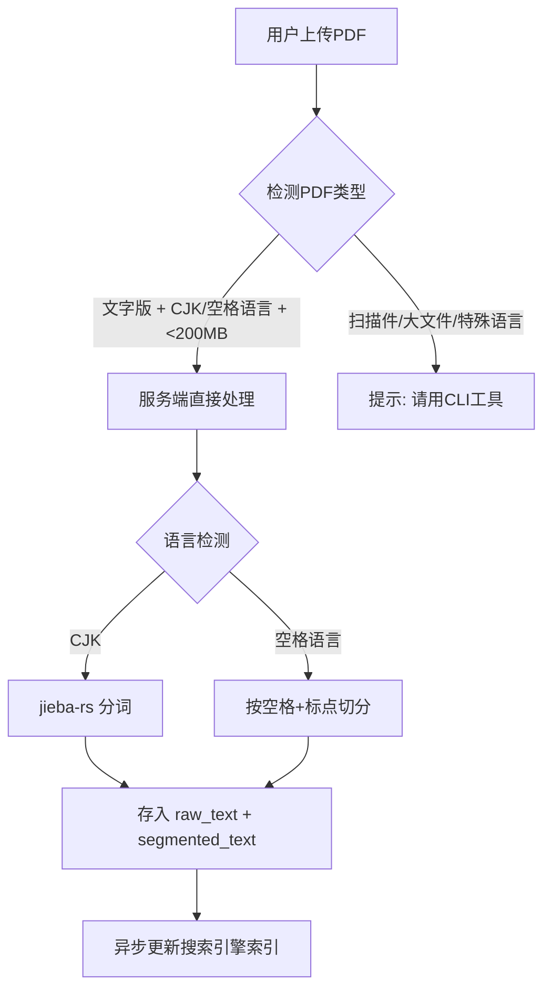

# 分词搜索方案 — 前端分词 + 服务端多层融合

## 🎯 核心原则

**前端负责分词，服务端只管匹配。jieba-rs 各端独立使用，互不依赖。**

```
┌─────────────────────────────────────────────────┐
│ 前端（Web WASM / Flutter FFI）                    │
│                                                 │
│  jieba-rs 分词用户输入                            │
│  "人工智能技术" → "人工 智能 技术"                  │
│  → 发送已分词的查询到服务端                         │
└──────────────────────┬──────────────────────────┘
                       │ GET /search?q=人工 智能 技术
                       ▼
┌─────────────────────────────────────────────────┐
│ 服务端（零分词依赖）                               │
│                                                 │
│  收到空格分隔的查询 → 直接走多路融合                 │
│  路径 A: raw_text LIKE (兜底)                     │
│  路径 B: tsvector GIN (索引加速)                   │
│  路径 C: Tantivy BM25 (排序+模糊)                  │
│                                                 │
│  服务端 jieba-rs 仅在导入 PDF 时使用 ✅             │
└─────────────────────────────────────────────────┘
```

**为什么前端分词？**
- 用户输入 "人工智能技术"（无空格）→ WASM 分词 → "人工 智能 技术" → 服务端直接走索引路径
- 绕过了"用户不加空格就没法走索引"的问题
- 服务端搜索路径零分词依赖，完全机械匹配
- 前端分词失败（WASM 未加载）→ 自动降级，服务端走路径 A LIKE 兜底

**jieba-rs 在各端的角色：**

| 端 | 使用场景 | 时机 |
|----|---------|------|
| 服务端 | PDF 导入时分词 → segmented_text | 仅导入时 |
| Web 前端 | jieba-rs WASM 分词用户查询 | 每次搜索 |
| Flutter 客户端 | jieba-rs FFI 分词用户查询 | 每次搜索 |
| CLI 工具 | OCR/大文件导入时分词 | 仅导入时 |

---

## 🔍 搜索策略：多路召回融合

已分词查询到达服务端后，三层并行召回，去重融合：

```
GET /search?q=人工 智能 技术
              │
    ┌─────────┼─────────┐
    ▼         ▼         ▼
  路径A      路径B      路径C
  LIKE    tsvector   Tantivy
  (兜底)   (GIN)     (BM25)
    │         │         │
    └─────────┼─────────┘
              ▼
    ┌──────────────────┐
    │  去重融合          │
    │  Tantivy 结果打头  │
    │  tsvector 补充     │
    │  LIKE 垫底确保不漏  │
    └──────────────────┘
              │
              ▼
         返回给前端
```

| 路径 | 引擎 | 触发条件 | 作用 |
|------|------|---------|------|
| **路径 A** | `raw_text` LIKE | 总是执行 | 兜底，确保不漏 |
| **路径 B** | tsvector + GIN | 查询含空格时 | 索引加速，毫秒级 |
| **路径 C** | Tantivy BM25 | 查询含空格时 | 最佳排序 + 模糊搜索 + 高亮 |

### 各场景命中情况

| 用户输入 | 前端分词后 | 路径A | 路径B | 路径C | 最终 |
|----------|-----------|-------|-------|-------|------|
| "人工智能" | "人工 智能" | ✅ LIKE兜底 | ✅ GIN秒出 | ✅ BM25排序 | 三路融合 |
| "人工智能技术" | "人工 智能 技术" | ✅ | ✅ | ✅ | 三路融合 |
| "人工 智能"（已有空格） | "人工 智能" | ✅ | ✅ | ✅ | 三路融合 |
| "工智能正"（跨词碎片） | "工智能正" | ✅ LIKE兜底 | ❌ | ❌ | 单路 |

> **关键**：前端分词后用户输入变得和 `segmented_text` 格式一致（都是空格分隔的词），索引路径自然命中。

---

## 🏗️ 搜索架构选择

### 四层渐进 + 多层融合

搜索能力分四层，通过环境变量 `SEARCH_LAYER` 切换。**第 3 层开启时，前两层自动并行运行**，结果融合去重后返回：

| 层级 | SEARCH_LAYER | 引擎 | 额外内存 | 融合策略 |
|------|-------------|------|----------|---------|
| 1 | `like` (默认) | PG LIKE 单路 | 0MB | 仅路径 A |
| 2 | `tsvector` | PG tsvector + LIKE | 0MB | 路径 B + 路径 A 去重 |
| 3 | `tantivy` | Tantivy + tsvector + LIKE | 20-50MB | 三路融合：Tantivy 打头，tsvector 补充，LIKE 垫底 |
| 4 | `external` | Sonic/Typesense + LIKE | 10-500MB | 外部引擎 + LIKE 去重 |

### 升级路径

```
刚部署                  想要排序                  要专业搜索             公开服务
  │                       │                         │                   │
  ▼                       ▼                         ▼                   ▼
第 1 层                 第 2 层                   第 3 层              第 4 层
LIKE ──────────→ PG tsvector+LIKE ──────→ Tantivy+tsvector+LIKE → External+LIKE
                     自动融合                   三路融合              外部+兜底

切换方式：改环境变量 + 重启（第4层需先部署外部引擎）
上层 API 完全透明
```

### 各层能力矩阵

| | 第1层 LIKE | 第2层 tsvector | 第3层 Tantivy | 第4层 Sonic | 第4层 Typesense | 第4层 ES |
|---|---|---|---|---|---|---|
| 相关性排序 | ❌ | ⚠️ 基础 | ✅ BM25 | ❌ | ✅ BM25 | ✅ BM25 |
| 模糊搜索 | ❌ | ❌ | ✅ (编辑距离) | ❌ | ✅ | ✅ |
| 高亮片段 | ❌ | ❌ | ✅ | ❌ | ✅ | ✅ |
| 多路融合 | ❌ | tsvector + LIKE | Tantivy + tsvector + LIKE | 外部 + LIKE | 外部 + LIKE | 外部 + LIKE |
| 额外进程 | 0 | 0 | 0 | 1 | 1 | 1+ |
| 额外内存 | 0 | 0 | 20-50MB | 10-30MB | 80-150MB | 512MB+ |

---

## 🌐 引擎部署模式：全部独立服务，HTTP/TCP 连接

**所有搜索引擎都是独立进程**，与 Rust 后端通过 HTTP 或 TCP 通信。可以部署在同一台 VPS，也可以部署在完全不同的机器上。

```
┌──────────────────────┐          HTTP/TCP         ┌──────────────────────┐
│     VPS A（应用）      │ ──────────────────────→   │   VPS B（搜索引擎）    │
│                       │                           │                      │
│  Rust 后端 :8080      │   search_engine:          │  Typesense :8108     │
│  PG :5432             │     url: "http://         │  Meilisearch :7700   │
│  MinIO :9000          │      vps-b:8108"          │  Sonic :1491         │
│                       │                           │  ES :9200            │
├───────────────────────┤                           ├──────────────────────┤
│ 内存紧张 (512MB)       │                           │ 内存充裕 (1-4GB+)     │
│ 只跑应用和数据库        │                           │ 搜索引擎独占资源       │
└──────────────────────┘                           └──────────────────────┘
```

| 引擎 | 协议 | 默认端口 | 远程部署 | 连接方式 |
|------|------|----------|----------|----------|
| Elasticsearch | HTTP REST | 9200 | ✅ | `http://<host>:9200` |
| Meilisearch | HTTP REST | 7700 | ✅ | `http://<host>:7700` |
| Typesense | HTTP REST | 8108 | ✅ | `http://<host>:8108` |
| Sonic | TCP 自定义 | 1491/1492 | ✅ | `sonic.NewSearch("host:1491")` |

### config/app.yaml 远程配置示例

```yaml
# 方式1：同一台机器
search_engine:
  type: "typesense"
  typesense:
    url: "http://localhost:8108"
    api_key: "typesense_secret"

# 方式2：同一内网另一台 VPS
search_engine:
  type: "typesense"
  typesense:
    url: "http://10.0.0.5:8108"
    api_key: "typesense_secret"

# 方式3：通过 Tailscale/WireGuard 内网穿透
search_engine:
  type: "sonic"
  sonic:
    host: "100.64.0.2"       # Tailscale 私有 IP
    search_port: 1491
    ingest_port: 1492
    password: "SecretPassword"
```

> **安全提示**：不要将搜索引擎端口直接暴露在公网（`0.0.0.0:8108`），这些引擎的认证通常只有一个 API Key。用防火墙/VPN/内网隔离。

---

### 第 1 层：LIKE 匹配（默认，零配置）

前端分词后，服务端收到空格分隔的查询 → 直接 LIKE raw_text 兜底：

```sql
-- 前端已分词为 "人工 智能 技术"
-- 服务端路径 A（总是执行）
SELECT * FROM document_content
WHERE raw_text LIKE '%人工智能技术%'    -- 原文兜底
   OR segmented_text LIKE '%人工%'     -- 按空格拆词
  AND segmented_text LIKE '%智能%'
  AND segmented_text LIKE '%技术%';
```

- **内存占用**：0MB（纯 PG 内置）
- **配置**：`SEARCH_LAYER=like`（默认值）
- **适用**：刚部署、测试阶段、个人文档 < 100 本

### 第 2 层：PG tsvector + LIKE（环境变量开启）

在 `document_content` 表上加计算列（同建表 SQL，见 `04-数据库设计.md`）：

搜索时自动融合 tsvector + LIKE：

```sql
-- 第 2 层：tsvector（走 GIN 索引）+ raw_text LIKE（兜底）融合
SELECT *, ts_rank(content_tsv, query) AS rank
FROM document_content,
     to_tsquery('simple', '人工 & 智能 & 技术') AS query
WHERE content_tsv @@ query                        -- 路径B: GIN索引
   OR raw_text LIKE '%人工智能技术%'               -- 路径A: LIKE兜底
ORDER BY rank DESC;
```

- **内存占用**：0MB（PG 内置 GIN 索引）
- **配置**：`SEARCH_LAYER=tsvector`
- **优势**：双路自动融合，GIN 索引毫秒级 + LIKE 确保不漏

### 第 3 层：Tantivy + tsvector + LIKE（三路融合，环境变量开启）

Tantivy 是 Lucene 的 Rust 实现，作为 crate 编译进服务端。**开启后自动并行运行 tsvector + LIKE，三路结果去重融合。**

```rust
// Tantivy 索引两个字段
let schema = schema!(
    raw_text:       text;              // 路径A：原文兜底
    segmented_text: text(tokenizer);   // 路径B+C：索引加速
);

// 三路融合搜索（前端已分词，查询自带空格）
async fn search_fusion(query: &str) -> Vec<SearchResult> {
    let terms: Vec<&str> = query.split_whitespace().collect();

    // 三路并行
    let (tantivy, tsvector, like) = tokio::join!(
        tantivy_search(&terms),          // 路径C: BM25 + 模糊
        pg_tsvector_search(&terms),      // 路径B: GIN索引
        pg_like_search(query),           // 路径A: LIKE兜底
    );

    // 去重融合: Tantivy → tsvector → LIKE
    merge_dedup(tantivy, tsvector, like)
}
```
);

// 双路径搜索：
// - 用户无空格 → 查 raw_text 字段
// - 用户有空格 → 查 segmented_text 字段（BM25 打分 + 模糊搜索 + 高亮）
let query = query_parser.parse_query("人工 智能")?;
let top_docs = searcher.search(&query, &TopDocs::with_limit(20))?;
```

- **内存占用**：20-50MB（同进程，非独立服务）
- **配置**：`SEARCH_LAYER=tantivy`
- **优势**：
  - 三路自动融合：Tantivy BM25 打头 → tsvector GIN 补充 → LIKE 兜底
  - 模糊搜索（搜"人功智能" → 命中"人工智能"）、高亮片段
  - Rust 原生 crate，`cargo build` 即用，零部署成本

### 第 4 层：外部搜索引擎 + LIKE 融合（环境变量开启）

独立进程/独立机器运行。外部引擎 + PG LIKE 双路融合。**搜索时 CLI 和 jieba-rs 均不参与。**

```
┌──────────┐         ┌──────────────────┐
│ VPS A    │  HTTP   │ VPS B (或本机)     │
│ 512MB    │ ──────→ │ Sonic :1491       │
│ 服务端+PG│         │ Typesense :8108   │
└──────────┘         │ Meilisearch :7700 │
                     │ ES :9200          │
                     └──────────────────┘
```

| 引擎 | 内存 | 协议 | 端口 | 搜索方式 |
|------|------|------|------|---------|
| Sonic | 10-30MB | TCP 自定义 | 1491/1492 | 用户空格拆词后发查询，Sonic 返回 doc ID |
| Typesense | 80-150MB | HTTP REST | 8108 | 用户空格拆词 → 索引查询；无空格 → 查 raw_text |
| Meilisearch | ~100MB | HTTP REST | 7700 | 同上 |
| Elasticsearch | 512MB+ | HTTP REST | 9200 | 同上 |

**配置示例**：

```yaml
search:
  layer: "external"
  external:
    engine: "sonic"
    sonic:
      host: "127.0.0.1"
      search_port: 1491
      ingest_port: 1492
      password: "SecretPassword"
```

- **配置**：`SEARCH_LAYER=external`
- **适用**：大规模多用户、需要水平扩展、专业运维场景

> **关键优势**：由于文本已被 jieba-rs 分好词，所有外部引擎只需按空格建倒排索引。Typesense/Meili 自带的 CJK 分词能力对本项目是冗余的。搜索时服务端也不调用 jieba-rs，用户自己空格拆词即可走索引路径。

---

## 🌐 前端分词

**核心原则：只有中文需要前端分词。其他语言要么本身有空格，要么用浏览器原生 API。**

### 分语言处理策略

```javascript
async function segmentForSearch(query, lang) {
    // 1. CJK（中/日/韩）→ jieba-rs WASM
    //    日文/韩文 jieba-rs 不够准，但能提供基本断词
    if (['zh', 'ja', 'ko'].includes(lang)) {
        await ensureWasmLoaded();
        return jieba.cut(query, true).join(' ');
    }

    // 2. 泰语/高棉语/老挝语 → 浏览器原生 Intl.Segmenter（零依赖！）
    if (['th', 'km', 'lo', 'my'].includes(lang)) {
        const seg = new Intl.Segmenter(lang, { granularity: 'word' });
        return [...seg.segment(query)]
            .filter(s => s.isWordLike)
            .map(s => s.segment)
            .join(' ');
    }

    // 3. 阿拉伯语等 RTL 语言 → 本身就有空格，原样发送
    // 4. 英文/俄文/所有空格语言 → 用户本来就会加空格
    return query;
}
```

### 各语言前端行为

| 语言 | 用户输入示例 | 前端动作 | 发给服务端 | 搜索路径 |
|------|------------|---------|-----------|---------|
| 中文 | `人工智能技术` | jieba-rs WASM → `人工 智能 技术` | 已分词 | 三路融合 |
| 日文 | `人工知能技術` | jieba-rs → `人工 知能 技術` | 已分词 | 三路融合 |
| 英文 | `artificial intelligence` | 不动 | 原文（已有空格） | 三路融合 |
| 俄文 | `искусственный интеллект` | 不动 | 原文 | 三路融合 |
| 阿拉伯文 | `ذكاء اصطناعي` | 不动 | 原文（已有空格） | 三路融合 |
| 泰文 | `ปัญญาประดิษฐ์` | Intl.Segmenter → `ปัญญา ประดิษฐ์` | 已断词 | 三路融合 |

> **阿拉伯语**：本身就按空格分隔词，换行连写不影响搜索（`segmented_text` 存的是空格分隔词）。CLI 导入时空格切分即可，前端不需要任何处理。
> **泰语**：`Intl.Segmenter` 是浏览器原生 API（Chrome 87+, Safari 15.4+），零依赖，零体积。

### 方案选择

| 方案 | 适用语言 | 体积 | 准确率 | 推荐 |
|------|---------|------|--------|------|
| **jieba-rs WASM** | 中文/日文/韩文 | ~3MB（可缓存） | ⭐⭐⭐⭐⭐ | ✅ |
| **Intl.Segmenter** | 泰语/高棉语/老挝语 | **0KB**（浏览器内置） | ⭐⭐⭐⭐ | ✅ |
| 简单 n-gram | 降级方案 | < 1KB | ⭐⭐⭐ | 备选 |

### jieba-rs WASM 使用

```javascript
import init, { cut } from 'jieba-wasm';

await init();  // 首次加载 ~3MB，浏览器缓存

function search(query) {
    const segmented = cut(query, true).join(' ');
    return fetch(`/api/search?q=${encodeURIComponent(segmented)}`);
}
```

### 降级策略

```
前端 WASM 加载成功 → 分词后发送 → 服务端走三路融合
前端 WASM 加载失败 → 原文发送     → 服务端只走路径 A (raw_text LIKE)
前端已有空格       → 直接发送     → 服务端走融合路径
查询是空格语言     → 原样发送     → 服务端走融合路径（本身有空格）
```

---

## ⚙️ 导入时分词策略

后台设置一个**特性开关 (Feature Flag)**，控制是否启用 jieba-rs 分词（仅导入时）。

### 导入时处理流程



### 搜索时处理流程（前端分词 + 服务端融合）

```mermaid
graph TD
    A[用户输入] --> B{前端 WASM 分词}
    B -- 成功 --> C[已分词: "人工 智能 技术"]
    B -- 失败/未加载 --> D[原文: "人工智能技术"]
    C --> E[发到服务端]
    D --> E
    E --> F{查询含空格?}
    F -- 是 --> G{SEARCH_LAYER?}
    F -- 否 --> H[路径A: raw_text LIKE - 兜底]
    G -- like --> H
    G -- tsvector --> I[路径B: GIN + 路径A: LIKE 去重]
    G -- tantivy --> J[路径C: BM25 + 路径B + 路径A 三路融合]
    G -- external --> K[外部引擎 + 路径A: LIKE 双路融合]
    H --> L[返回结果]
    I --> L
    J --> L
    K --> L
```

### ⚠️ 多语言支持注意事项

**jieba-rs 在服务端仅用于导入时的 CJK 分词。前端 WASM 分词覆盖所有搜索场景。**

- **西里尔/拉丁语系 (俄语、德语、法语等)**：
  - **导入**：按空格+标点切分 → 存入 `segmented_text`
  - **搜索**：前端 WASM 分词 / 用户自身空格拆词 → 走融合路径
- **非空格语言 (泰语、高棉语等)**：
  - 必须使用 CLI 工具预处理（Unicode 断字 + 打包上传）

---

## 🛠️ 实现细节

### 1. 配置结构 (app.yaml)

```yaml
# 搜索层级
search:
  layer: "like"   # like | tsvector | tantivy | external

# 分词器配置（仅导入时使用，搜索路径不调用）
segmenter:
  enable_cjk: true           # CJK 启用 jieba-rs 分词
  dict_path: "config/dictionary.txt"
```

### 2. 导入时：SegmentService（仅导入时调用）

```rust
// src/service/segment_service.rs
// 注意：此服务仅在导入 PDF 时使用，搜索路径不调用

use jieba_rs::Jieba;
use std::sync::RwLock;

pub struct SegmentService {
    segmenter: RwLock<Jieba>,
}

impl SegmentService {
    /// 导入时：对 PDF 文本做一次性分词，存入 segmented_text
    pub fn segment_for_index(&self, text: &str, lang: &str) -> Result<String, AppError> {
        Ok(match lang {
            "zh" | "ja" | "ko" => {
                let seg = self.segmenter.read().unwrap();
                seg.cut(text, true).join(" ")
            }
            // 空格语言：按空格+标点切分
            _ if is_space_lang(lang) => {
                text.split(|c: char| !c.is_alphanumeric())
                    .filter(|w| !w.is_empty())
                    .map(|w| w.to_lowercase())
                    .collect::<Vec<_>>()
                    .join(" ")
            }
            _ => return Err(AppError::UnsupportedLanguage(lang.to_string())),
        })
    }
}

fn is_space_lang(lang: &str) -> bool {
    matches!(lang, "en" | "fr" | "de" | "ru" | "es" | "pt" | "it" | "nl" 
                  | "sv" | "da" | "no" | "fi" | "tr" | "vi" | "id" | "ms" | "pl")
}
```

### 3. 搜索时：SearchService（三路融合，零 jieba-rs 依赖）

```rust
// src/service/search_service.rs
// 前端已分词，查询自带空格。服务端零分词依赖。

impl SearchService {
    pub async fn search(&self, query: &str) -> Vec<SearchResult> {
        // 前端发送的查询已分词：空格分隔的词语
        let has_spaces = query.contains(' ');

        if !has_spaces {
            // 降级：前端没分词 → 只走 LIKE
            return self.repo.search_by_like(query).await;
        }

        match self.config.search_layer {
            SearchLayer::Like => {
                // 第 1 层：按空格拆词 LIKE
                let terms: Vec<&str> = query.split_whitespace().collect();
                self.repo.search_by_terms(&terms).await
            }

            SearchLayer::Tsvector => {
                // 第 2 层：tsvector + LIKE 双路去重
                let (tsv, like) = tokio::join!(
                    self.repo.search_by_tsvector(query),
                    self.repo.search_by_like(query),
                );
                merge_dedup_by_priority(tsv, like)
            }

            SearchLayer::Tantivy => {
                // 第 3 层：Tantivy + tsvector + LIKE 三路融合
                let (tantivy, tsv, like) = tokio::join!(
                    self.tantivy.search(query),        // BM25 模糊
                    self.repo.search_by_tsvector(query),// GIN 索引
                    self.repo.search_by_like(query),    // LIKE 兜底
                );
                // 去重：Tantivy 打头 → tsvector 补充 → LIKE 垫底
                merge_dedup_by_priority(tantivy, tsv, like)
            }

            SearchLayer::External => {
                // 第 4 层：外部引擎 + LIKE 双路
                let (ext, like) = tokio::join!(
                    self.ext_engine.query(query),
                    self.repo.search_by_like(query),
                );
                merge_dedup_by_priority(ext, like)
            }
        }
    }
}

/// 多路结果按优先级去重融合
fn merge_dedup_by_priority(
    primary: Vec<SearchResult>,
    secondary: Vec<SearchResult>,
    fallback: Vec<SearchResult>,
) -> Vec<SearchResult> {
    let mut seen: HashSet<(i32, i32)> = HashSet::new();
    let mut merged = Vec::new();

    for r in primary.into_iter()
        .chain(secondary.into_iter())
        .chain(fallback.into_iter())
    {
        if seen.insert((r.doc_id, r.page_num)) {
            merged.push(r);
        }
    }
    merged
}

### 4. 自定义词典与热更新 (Dynamic Dictionary)

为了解决特定领域名词 (如 "深度学习", "Transformer模型") 无法识别的问题，系统支持**数据库级自定义词典**，此功能无需重启即生效。

#### (1) 数据库设计

```sql
CREATE TABLE custom_dictionary (
   id SERIAL PRIMARY KEY,
   term VARCHAR(100) NOT NULL UNIQUE, -- 词汇 (e.g., "Transformer")
   frequency INT DEFAULT 0,           -- 词频 (用于Jieba, GSE默认忽略或使用高频)
   nature VARCHAR(20) DEFAULT 'nz',   -- 词性 (可选)
   is_enable BOOLEAN DEFAULT TRUE,    -- 是否启用
   updated_at TIMESTAMP DEFAULT CURRENT_TIMESTAMP
);
```

#### (2) 热更新流程 (Hot Reload)

1.  **后台管理**：管理员在后台添加/编辑词汇 -> 写入 PG 数据库。
2.  **通知机制**：应用检测到变更 (或通过 Redis Pub/Sub 通知)。
3.  **内存加载**：
  -   **jieba-rs**：调用 `jieba.add_word("自定义词", freq, None)`。
4.  **生效**：后续的分词操作立即生效，**无需重启服务**。
5.  **启动加载**：服务重启时，自动加载 `dict_path` 文件 + `custom_dictionary` 表中的所有词汇。

### 4. 内存说明（Rust 版本）

- jieba-rs 仅在导入 PDF 时使用（懒加载，10 分钟无新任务自动释放 ~15-30MB）
- 搜索路径不加载 jieba-rs，搜索时内存额外占用为 0
- Tantivy（第 3 层）同进程运行，~20-50MB
- 空闲时服务端总计 ~48MB，处理 PDF 时 ~73MB，开启 Tantivy ~100MB（512MB 下仍有 400MB+ 余量）

### 5. 数据存储策略 (Hybrid Indexing)

采用 **"jieba-rs 导入分词 + 双字段存储"** 策略：

| 字段名 | 存储内容 | 搜索路径 | 用途 |
| :--- | :--- | :--- | :--- |
| **`raw_text`** | PDF 原始文本 | 路径 A（总是启用） | LIKE 兜底，确保任何输入都能搜到 |
| **`segmented_text`** | jieba-rs 分词后空格分隔 | 路径 B（用户加空格时启用） | GIN/tsvector/Tantivy 索引加速 |

**SQL 查询逻辑（搜索端不调用 jieba-rs）**：

```sql
-- 用户输入 "人工智能"（无空格）→ 路径A：直接 LIKE raw_text
SELECT * FROM document_content
WHERE raw_text LIKE '%人工智能%'
   OR segmented_text LIKE '%人工智能%';

-- 用户输入 "人工 智能"（有空格）→ 路径B：走 GIN 索引加速
SELECT *, ts_rank(content_tsv, query) AS rank
FROM document_content,
     to_tsquery('simple', '人工 & 智能') AS query
WHERE content_tsv @@ query
ORDER BY rank DESC;
```

### 6. 异步分词架构 (Asynchronous Processing)

为了解决实时分词带来的性能问题，采用**异步队列**机制：

1.  **用户上传**：API 接收 PDF -> 保存文件 -> 写入 `documents` 表 (status='processing') -> **立即响应 HTTP 200**。
2.  **后台 Worker**：
    *   监听上传事件或轮询。
    *   提取文本。
    *   执行 **jieba-rs 分词** (耗时操作) → 生成 `segmented_text`
    *   更新 `document_content` 表的 `raw_text` 和 `segmented_text`
    *   将 `documents` 状态更新为 `ready`
3.  **前端体验**：上传后显示“处理中”，处理完成后自动刷新或通过 WebSocket 通知。

### 7. 分词引擎说明（仅导入时使用）

jieba-rs 作为唯一的导入时分词引擎，仅在服务端处理 PDF 导入时调用。搜索路径不依赖分词。

| 维度 | jieba-rs (Rust) |
| :--- | :--- |
| **算法原理** | **HMM (隐马尔可夫模型)** + 字典树 (Trie) |
| **新词发现** | ✅ **支持** (基于统计模型发现未登录词) |
| **内存占用** | **低** (~15-30MB，懒加载，空闲释放) |
| **使用范围** | **仅导入时**（服务端处理 PDF / CLI 工具） |
| **分词速度** | 快 (~4MB/s) |
| **准确率** | ⭐⭐⭐⭐⭐ (适合文学、长文本) |

> **关键**：jieba-rs 仅在导入时使用。搜索时用户自己空格拆词，或服务端按空格 split 后发送给 Sonic。详情见「搜索策略：双路径查询」章节。

---

## 🆕 第 4 层深入：Sonic + PG 完整方案

### Sonic 简介

> Sonic 是由 Rust 编写的**无本体搜索引擎**。它不存储文档内容，只存储倒排索引并返回匹配的 `(bucket, object_id)`。

### Sonic 数据流

```
导入时（使用 jieba-rs）：
  PDF 文本 → jieba-rs 分词 → 推送到 Sonic bucket

搜索时（不用 jieba-rs）：
  用户输入 "人工 智能"（带空格）→ split(' ') → ["人工","智能"] → 发送给 Sonic
  Sonic 返回 ["doc_101_pg_5", "doc_101_pg_12"]
  → 回 PG: WHERE id IN (...) → 返回结果
```

```
┌──────────────────────────────────────────────────┐
│                  Rust 应用层                       │
│                                                    │
│  导入时：                                          │
│  ┌──────────┐                                     │
│  │ jieba-rs│ → 分词 → segmented_text              │
│  │ (仅此时) │ → 推送 → Sonic bucket                │
│  └──────────┘                                     │
│                                                    │
│  搜索时（不用 jieba-rs）：                          │
│  用户输入 → split(' ') → Sonic → PG → 结果         │
└──────────────────────────────────────────────────┘
```

### Sonic 数据模型

Sonic 使用 `bucket → collection → object` 三级结构：

| 层级 | 本项目映射 | 示例 |
|------|-----------|------|
| bucket | 用户 ID | `user_123`（每个用户独立隔离） |
| collection | 集合类型 | `documents`（文档内容）、`highlights`（标记文本） |
| object | 数据对象 ID | `doc_101_pg_5`（文档ID + 页码） |

### Rust 客户端集成

```go
// src/service/sonic_service.rs

use sonic_channel::{SearchChannel, IngestChannel, Dest};
use crate::util::segment::segment_text;

pub struct SonicService {
    search: SearchChannel,
    ingest: IngestChannel,
}

impl SonicService {
    /// Sonic 使用 TCP 协议，分 Search 和 Ingest 两个端口
    pub async fn connect(host: &str, search_port: u16, ingest_port: u16, password: &str) -> Result<Self, sonic_channel::Error> {
        let search = SearchChannel::connect(format!("{}:{}", host, search_port), password).await?;
        let ingest = IngestChannel::connect(format!("{}:{}", host, ingest_port), password).await?;
        Ok(Self { search, ingest })
    }

    /// 将分词后的文档推入 Sonic 索引
    pub async fn index_document(
        &self,
        user_id: i32,
        doc_id: i32,
        page_num: i32,
        raw_text: &str,
    ) -> Result<(), anyhow::Error> {
        let bucket = format!("user_{}", user_id);
        let object_id = format!("doc_{}_pg_{}", doc_id, page_num);
        
        // jieba-rs 分词后以空格连接
        let segmented = segment_text(raw_text);

        self.ingest.push(
            Dest::col(&bucket, "documents"),
            &object_id,
            &segmented,
            Some("zho"),
        ).await?;
        Ok(())
    }

    /// 搜索并返回匹配的 object ID 列表（搜索时不用 jieba-rs）
    pub async fn search(
        &self,
        user_id: i32,
        query: &str,    // 已经是空格分隔的词（如 "人工 智能"）
        limit: usize,
    ) -> Result<Vec<String>, anyhow::Error> {
        let bucket = format!("user_{}", user_id);
        // 直接发送，不调 jieba-rs。查询词已由上层 SearchService 按空格拆分
        
        let results = self.search.query(
            Dest::col(&bucket, "documents"),
            query,
            Some(limit),
            None,
        ).await?;
        Ok(results)
    }
}

/// 从 Sonic 结果解析 docID + pageNum
pub fn extract_doc_page_ids(object_ids: &[String]) -> (Vec<i32>, Vec<i32>) {
    object_ids.iter().filter_map(|id| {
        let parts: Vec<&str> = id.split('_').collect();
        if parts.len() == 4 {
            Some((parts[1].parse::<i32>().ok()?, parts[3].parse::<i32>().ok()?))
        } else { None }
    }).unzip()
}
```

### 搜索完整流程（Sonic，搜索时不调 jieba-rs）

```rust
// src/service/search_service.rs
// 搜索时不用 jieba-rs，直接按空格 split

impl SearchService {
    pub async fn search_with_sonic(
        &self,
        user_id: i32,
        query: &str,
        limit: usize,
    ) -> Result<Vec<SearchResult>, AppError> {
        // 1. 按空格拆词（不用 jieba-rs）
        let query_words: Vec<&str> = query.split_whitespace().collect();
        let query_str = query_words.join(" ");

        // 2. Sonic 查询，返回 object ID（形如 "doc_101_pg_5"）
        let object_ids = self.sonic.search(user_id, &query_str, limit).await?;
        let (doc_ids, page_nums) = extract_doc_page_ids(&object_ids);

        // 3. 回 PG 主键查询（利用索引，极快）
        let mut results = self.repo.find_by_ids_and_pages(&doc_ids, &page_nums).await?;

        // 4. 高亮标记
        for r in &mut results {
            r.snippet = highlight_terms(&r.raw_text, &query_words);
        }

        Ok(results)
    }
}
```

### Sonic 配置

```yaml
# config/app.yaml
search_engine:
  type: "sonic"
  sonic:
    host: "localhost"       # 或 Docker 服务名
    port: 1491              # Search 端口
    ingest_port: 1492       # Ingest 端口（默认 search_port + 1）
    password: "SecretPassword"

segmenter:
  mode: "jieba"             # Rust 使用 jieba-rs；Go 版本对应 gse
  enable_cjk: true
```

### Sonic Docker Compose

```yaml
  sonic:
    image: valeriansaliou/sonic:v1.4.9
    container_name: pdf-search-sonic
    environment:
      SONIC_SEARCH_PASSWORD: SecretPassword
      SONIC_INGEST_PASSWORD: SecretPassword
    volumes:
      - sonic_data:/var/lib/sonic/store
      - ./config/sonic.cfg:/etc/sonic.cfg:ro
    networks:
      - pdf-network
```

**sonic.cfg**：
```ini
[server]
log_level = "warn"

[channel]
inet = "0.0.0.0:1491"
tcp_timeout = 300

[channel.search]
query_limit_default = 20
query_limit_maximum = 100
query_parser_max_depth = 5

[store]
store_path = "/var/lib/sonic/store/"
```

---

## 🆕 第 4 层深入：Typesense 配置

### Typesense 容器配置

```yaml
  typesense:
    image: typesense/typesense:27.0
    container_name: pdf-search-typesense
    environment:
      TYPESENSE_API_KEY: typesense_secret
      TYPESENSE_DATA_DIR: /data
      TYPESENSE_ENABLE_CORS: "true"
    volumes:
      - typesense_data:/data
    ports:
      - "8108:8108"
    networks:
      - pdf-network
```

### Typesense Collection Schema（创建时）

```go
// Go 初始化代码
schema := &typesense.CollectionSchema{
    Name: "documents",
    Fields: []typesense.Field{
        {Name: "doc_id", Type: "int32"},
        {Name: "title", Type: "string", Locale: "zh"},
        {Name: "content", Type: "string", Locale: "zh"},
        {Name: "page_num", Type: "int32"},
        {Name: "user_id", Type: "int32", Facet: true},
        {Name: "language", Type: "string", Facet: true},
    },
    DefaultSortingField: "page_num",
}
client.Collections().Create(schema)
```

### 搜索调用

```go
params := &typesense.SearchCollectionParams{
    Q:        "人工智能",
    QueryBy:  "content,title",
    FilterBy: fmt.Sprintf("user_id:%d", userID),
    PerPage:  20,
    Page:     1,
    HighlightFields: "content",
    HighlightStartTag: "<em>",
    HighlightEndTag:   "</em>",
}
result, _ := client.Collection("documents").Documents().Search(params)
```

---

## ⚖️ 搜索引擎选型决策树

```
┌──────────────────────────────────────────────────────────────┐
│                                                              │
│  关键认知 1: 搜索引擎可以独立部署，不消耗应用 VPS 内存          │
│  关键认知 2: 搜索时不用 jieba-rs，导入时才用                  │
│                                                              │
└──────────────────────────────────────────────────────────────┘

需要独立搜索引擎吗？

├── 不需要（和 Rust 后端同机）
│   ├── 文档 < 100 本           → 第 1 层 LIKE（零配置）
│   ├── 想要好一点的搜索          → 第 2 层 tsvector（0MB额外）
│   └── 想要专业搜索              → 第 3 层 Tantivy（20-50MB）
│
└── 需要（独立部署或另一台 VPS）  → 第 4 层
    ├── 内存极度受限（< 1GB）     → Sonic（10-30MB）
    ├── 中小规模 + 追求速度       → Typesense（80-150MB）
    ├── 零配置优先               → Meilisearch（~100MB）
    └── 大型生产 + 复杂聚合       → Elasticsearch（512MB+）

┌─────────────────────────────────────────────────────────────┐
│                                                             │
│  对本项目（512MB 应用 VPS）的建议：                           │
│                                                             │
│  💎 最佳方案：第 2 层 PG tsvector（零额外部署）               │
│     导入时 jieba-rs 分词，搜索时 GIN 索引毫秒级               │
│     用户加空格走索引路径，不加空格 raw_text LIKE 兜底          │
│                                                             │
│  🚀 升级方案：第 3 层 Tantivy（同进程 20-50MB）               │
│     模糊搜索 + BM25 打分 + 高亮片段                           │
│     不需要新开端口、不需要新装服务                             │
│                                                             │
└─────────────────────────────────────────────────────────────┘
```
